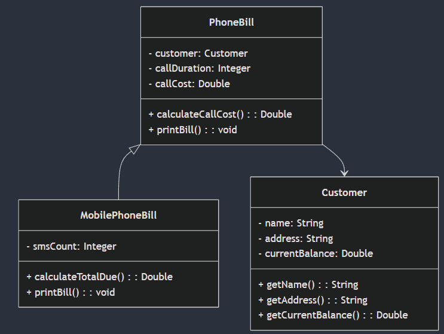

# AggregationInheritance
This assignment is based on calculating a PhoneBill for a Customer

  

# Synopsis of Phone Bill UML Class Diagram

## Classes and Attributes

### Customer class 1
**Attributes:**
- `name: String`
- `address: String` 
- `currentBalance: Double`

**Methods:**
- `getName(): String`
- `getAddress(): String`
- `getCurrentBalance(): Double`

### PhoneBill   class 2
**Attributes:**
- `customer: Customer`
- `callDuration: Integer`
- `callCost: Double`

**Methods:**
- `calculateCallCost(): Double`
- `printBill(): void`

### MobilePhoneBill class3
**Attributes:**
- `smsCount: Integer`

**Methods:**
- `calculateTotalDue(): Double`
- `printBill(): void`

## Relationships
- **Inheritance:** `MobilePhoneBill` inherits from `PhoneBill`
- **Association:** `PhoneBill` is associated with `Customer`

---
*This diagram outlines the essential structure and functionality of a phone billing system.*

